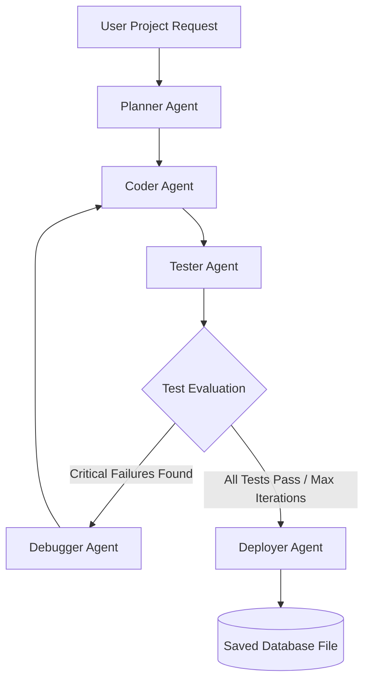
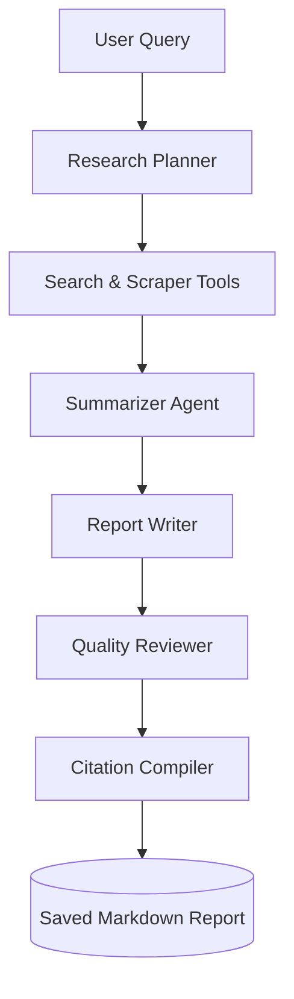
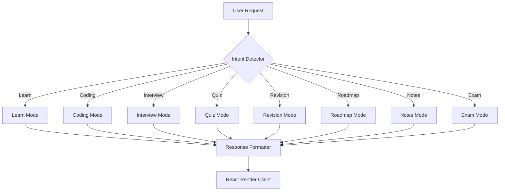
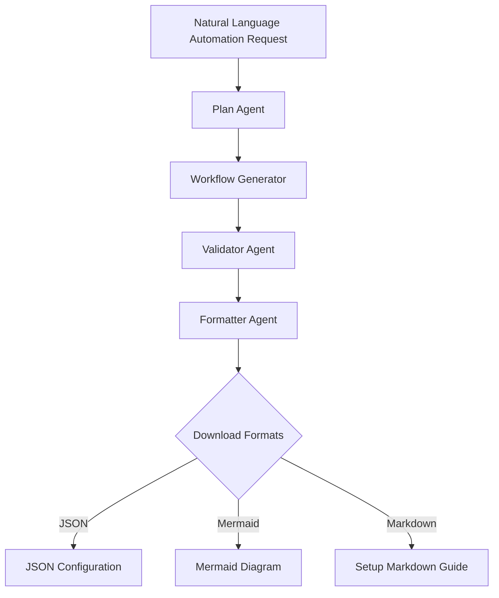
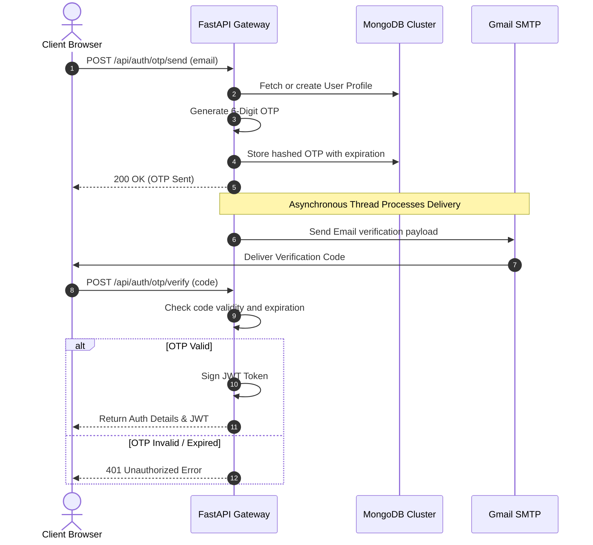
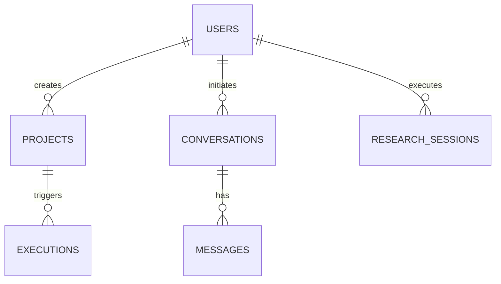
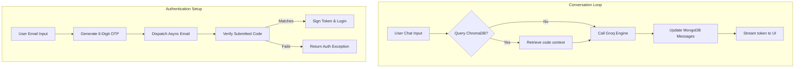

# 🤖 NeuroForge AI: Autonomous Multi-Agent AI Operating System

> **A Next-Generation, Enterprise-Grade Multi-Agent Lifecycle Runtime and Desktop Workspace.**
> Built on FastAPI, React, LangGraph, and ChromaDB, powered by Cyclic Groq Key Rotations.

---

## 💡 Executive Summary & Philosophy

### Introduction to NeuroForge AI
NeuroForge AI is not a standard AI wrapper or chat client. It is a comprehensive, stateful **Autonomous Multi-Agent AI Operating System (OS)** that treats LLMs and utility models as dynamic, scheduling processing cores. By leveraging advanced graph-based execution structures (`StateGraph`), persistent document stores (`MongoDB`), and semantic local vector memories (`ChromaDB`), NeuroForge AI schedules, runs, validates, and refines complex computational plans across five major modules:
*   **Engineer AI**: Stateful developer loop (Planner ➔ Coder ➔ Tester ➔ Debugger ➔ Deployer).
*   **Conversational AI**: High-throughput chat with persistent semantic memory.
*   **Research AI**: Internet-crawling investigation suite with auto-generated citations.
*   **Education AI**: Knowledge intent compiler with dynamic quizzes, sandboxes, and Mermaid roadmaps.
*   **Automation AI**: Natural language translation into production-ready API pipelines (n8n, Make, Zapier).

---

### System Architecture Overview

```mermaid
graph TB
    subgraph Client Client Space (React / SPA)
        Dashboard[Glassmorphic Control Center]
        EngPanel[Engineer UI & File Tree]
        ResPanel[Research Viewer & Citations]
        EduPanel[Interactive Quiz & Roadmaps]
        AutPanel[Workflow Editor & Canvas]
        StateCtx[Context API / Auth & Workspace State]
    end

    subgraph API Gateways & Routing (FastAPI)
        Gateway[API Gateway / Router]
        JWTAuth[JWT Signer & Google OAuth 2.0]
        OTPEngine[Async OTP Sender / SMTP Client]
        API_Routes[API Route Controllers]
    end

    subgraph Agent Execution Core (LangGraph & LangChain)
        LGraph[LangGraph State Machine]
        PlannerNode[Planner Agent Node]
        CoderNode[Coder Agent Node]
        TesterNode[Tester Agent Node]
        DebuggerNode[Debugger Agent Node]
        DeployerNode[Deployer Agent Node]
        LLMRotation[Groq Client Router / Cyclic Key Registry]
    end

    subgraph Vector & Document Databases
        ChromaDB[(ChromaDB Vector Store / Code Index)]
        MongoDB[(MongoDB Core Database)]
        LocalFS[(Local Filesystem Sandbox)]
    end

    Dashboard & EngPanel & ResPanel & EduPanel & AutPanel <--> StateCtx
    StateCtx <-->|Axios Requests & SSE Streams| Gateway
    Gateway <--> JWTAuth & OTPEngine & API_Routes
    API_Routes <--> LGraph
    LGraph <--> PlannerNode & CoderNode & TesterNode & DebuggerNode & DeployerNode
    PlannerNode & CoderNode & TesterNode & DebuggerNode & DeployerNode <--> LLMRotation
    LLMRotation <-->|Inference Pipelines| GroqAPI[[Groq Cloud Interface]]
    
    %% Storage links
    LGraph <-->|Read / Write State| MongoDB
    PlannerNode & CoderNode <-->|Embeddings Context| ChromaDB
    CoderNode & TesterNode & DebuggerNode <-->|Local Read/Write| LocalFS
```

---

## 🛠️ Comprehensive Technology Stack

| Technology Layer | Framework / Library | Configured Version | Key Architectural Responsibility |
| :--- | :--- | :--- | :--- |
| **Frontend Foundation** | React (Vite SPA) | `^18.2.0` | Fast, reactive SPA layout with optimized routing. |
| **Theme / Styles** | Vanilla CSS3 Variables | Native CSS3 | Customizable glassmorphic interfaces, CSS grid frameworks. |
| **API Web Server** | FastAPI (ASGI / Python) | `^0.100.0` | Asynchronous routers, Server-Sent Events (SSE) streaming. |
| **Database Connector** | PyMongo | `^4.4.0` | Highly efficient document validation and update schemas. |
| **Agent Orchestrator** | LangGraph | `^0.0.10` | Implements stateful cyclic and acyclic graphs. |
| **Chain Framework** | LangChain | `^0.0.250` | Manages prompts, templates, and output parsing structures. |
| **Vector DB** | ChromaDB Client | `^0.4.0` | Generates semantic indices for project reference docs. |
| **Inference Layer** | Groq Client SDK | `^0.5.0` | Interface with Groq API. |
| **Primary LLM** | Llama-3.3-70b-versatile | Llama-3.3 | Technical planning, complex coding, and code debugging. |
| **Multimodal Model** | Llama-3.2-11b-vision | Llama-3.2 | Evaluates images, design schematics, and UI snapshots. |
| **Auth Cryptography** | Passlib (bcrypt) / PyJWT | `^1.7.4` / `^2.8.0` | Encrypts JWT payloads and OTP validation hashes. |

---

## 📂 Codebase Directory Blueprint

```
.
├── backend/
│   ├── agents/                   # Multi-agent graphs, state definitions, and system nodes
│   │   ├── automation/           # Automation code mapper, router, and validating agents
│   │   │   ├── formatter.py      # Formats trigger/action definitions into clean YAML/JSON
│   │   │   ├── models.py         # n8n node templates and variable connection maps
│   │   │   ├── planner.py        # Parses user intent to outline automation steps
│   │   │   ├── prompts.py        # System templates for node placement algorithms
│   │   │   ├── router.py         # Directs steps to Google, Slack, Notion, or Webhooks
│   │   │   ├── validator.py      # Checks generated workflows for loops or broken links
│   │   │   └── workflow_generator.py # Converts abstract plans into operational platform JSON
│   │   ├── education/            # Education mode controllers, modes, and prompt configurations
│   │   │   ├── agent.py          # Entry point for intent classifier and router
│   │   │   ├── detector.py       # Identifies learn, coding, quiz, roadmap, or interview modes
│   │   │   ├── formatter.py      # Formats responses and embeds Mermaid blueprints
│   │   │   ├── router.py         # Routes inputs to active learning modules
│   │   │   ├── state.py          # Tracks learning progress, incorrect answers, and topics
│   │   │   ├── modes/            # Individual engines for learning modes (Exam, Quiz, Coding)
│   │   │   └── prompts/          # Templates for flashcards, rubrics, and roadmaps
│   │   ├── research/             # Scraper pipelines, summaries, and citation engines
│   │   │   ├── planner.py        # Generates search queries and crawl outlines
│   │   │   ├── researcher.py     # Crawls the web and extracts article text
│   │   │   ├── reviewer.py       # Validates information accuracy against source links
│   │   │   ├── supervisor.py     # Main coordinator managing research state updates
│   │   │   ├── writer.py         # Compiles final Markdown reports with markdown references
│   │   │   └── tools/            # Scraper utilities and search APIs
│   │   ├── coder.py              # Generates source code files based on planner specs
│   │   ├── debugger.py           # Corrects syntax and runtime errors from test reports
│   │   ├── deployer.py           # Configures Dockerfiles and container templates
│   │   ├── graph.py              # Compiles the LangGraph workflow structure
│   │   ├── planner.py            # Converts requirements into project blueprints
│   │   ├── router.py             # Conditional router (routes to Debugger or Deployer)
│   │   └── state.py              # Defines the AgentState TypedDict schema
│   ├── api/                      # Routing layers and validation models
│   │   ├── models/               # MongoDB models (User, Profile, Project, Execution)
│   │   ├── routes/               # API endpoints
│   │   │   ├── admin.py          # Admin endpoints, system monitors, and stats
│   │   │   ├── automation.py     # Coordinates n8n and Make pipeline generation
│   │   │   ├── conversations.py  # Handles core chat updates and history list requests
│   │   │   ├── download.py       # Generates ZIP/tarballs for codebase exports
│   │   │   ├── education.py      # Connects frontend chat prompts to learning modes
│   │   │   ├── execution.py      # Starts and monitors LangGraph software builds
│   │   │   ├── history.py        # Fetches session histories across modules
│   │   │   ├── memory.py         # Semantic memory extraction and search endpoint
│   │   │   ├── project.py        # CRUD operations for code projects
│   │   │   ├── research.py       # Initiates web search research tasks
│   │   │   ├── settings.py       # Manages user accounts and API key registries
│   │   │   ├── status.py         # System checks
│   │   │   └── user_memory.py    # Manages user profile data and context mappings
│   │   └── schemas.py            # Pydantic validation structures
│   ├── auth/                     # OTP code creation, hashing, and SMTP delivery
│   ├── core/                     # JWT decryption keys and configurations
│   ├── db/                       # MongoDB client managers and helper utilities
│   ├── llm/                      # Groq client router and rate limit management
│   ├── rag/                      # ChromaDB collections, chunking, and embeddings
│   ├── main.py                   # System startup file
│   └── requirements.txt          # Python dependencies
├── frontend/
│   ├── src/
│   │   ├── components/           # Common components and workspace widgets
│   │   │   ├── automation/       # Canvas components and node panels
│   │   │   ├── education/        # Flashcards, roadmaps, and markdown renderers
│   │   │   ├── research/         # Citation cards and report visualizers
│   │   │   └── workspace/        # Chat components
│   │   ├── contexts/             # Context state layers (Auth, Workspace)
│   │   ├── hooks/                # Hook utilities
│   │   ├── pages/                # Workspace views (Dashboard, Settings, Login)
│   │   ├── services/             # Axios request profiles
│   │   ├── App.jsx               # Navigation route controllers
│   │   └── main.jsx              # React app entry point
│   ├── vercel.json               # Vercel deployment setup
│   └── vite.config.js            # Vite build configuration
```

---

## 🤖 Deep Dive: AI Modules

---

### 💻 1. Engineer AI

#### Purpose & Capabilities
Engineer AI operates as an autonomous software engineering engine. It takes high-level ideas, creates architectural blueprints, designs files, validates code syntax, debugs execution errors, and compiles deployment specifications.



#### Detailed Agent Breakdown

##### A. Planner Agent
*   **Purpose**: Read request outlines and construct structural execution blueprints.
*   **Input Schema**:
    ```json
    {
      "idea": "Build a real-time chat server with FastAPI and WebSocket support",
      "user_id": "usr_998822",
      "mode": "new"
    }
    ```
*   **Output Schema**:
    ```json
    {
      "project_plan": {
        "title": "FastAPI WebSocket Chat Server",
        "architecture": "Asynchronous WebSockets with Redis PubSub backend",
        "files_to_create": [
          "main.py",
          "connection_manager.py",
          "requirements.txt",
          "index.html"
        ],
        "dependencies": ["fastapi", "uvicorn", "websockets", "redis"]
      }
    }
    ```
*   **Responsibilities**:
    1. Assess system complexity and dependencies.
    2. Interface with ChromaDB to fetch relevant code templates.
    3. Generate file paths and outline functional requirements.
*   **Internal Workflow & Decision Making**:
    Evaluates whether to build a new architecture or modify an existing structure by comparing files with the current repository status.

---

##### B. Coder Agent
*   **Purpose**: Write clean, functional code based on the project plan.
*   **Input Schema**:
    ```json
    {
      "project_plan": { "files_to_create": ["main.py"] },
      "idea": "Build a real-time chat server...",
      "project_id": "proj_1122"
    }
    ```
*   **Output Schema**:
    ```json
    {
      "generated_code": {
        "main.py": "from fastapi import FastAPI...\n"
      }
    }
    ```
*   **Responsibilities**:
    1. Write clean, modular, and syntax-compliant code.
    2. Build appropriate test frameworks and sample endpoints.
    3. Avoid placeholders or truncated code blocks.
*   **Internal Workflow**:
    Iterates over files in the plan, applies context from memory, and outputs clean source code blocks.

---

##### C. Tester Agent
*   **Purpose**: Validate code blocks for syntax, packaging, import, and logic errors.
*   **Input Schema**:
    ```json
    {
      "generated_code": {
        "main.py": "from fastapi import FastAPI..."
      }
    }
    ```
*   **Output Schema**:
    ```json
    {
      "test_results": {
        "status": "FAIL",
        "summary": { "critical_count": 1, "high_count": 0, "medium_count": 1, "low_count": 0 },
        "issues": [
          {
            "severity": "CRITICAL",
            "category": "SyntaxError",
            "description": "Missing closing parenthesis on line 12 of main.py",
            "suggested_fix": "Add closing parenthesis: app = FastAPI()"
          }
        ]
      }
    }
    ```
*   **Responsibilities**:
    1. Scan files for syntax errors and import issues.
    2. Verify dependency versions.
    3. Output structured bug reports with fix suggestions.
*   **Internal Workflow**:
    Runs AST parsing on Python scripts and lint syntax verification on JS code, mapping any issues to target lines.

---

##### D. Debugger Agent
*   **Purpose**: Resolve bugs identified in the Tester Agent's report.
*   **Input Schema**:
    ```json
    {
      "generated_code": { "main.py": "app = FastAPI(" },
      "test_results": { "issues": [{ "severity": "CRITICAL", "description": "Missing closing parenthesis..." }] }
    }
    ```
*   **Output Schema**:
    ```json
    {
      "fixed_code": { "main.py": "app = FastAPI()" }
    }
    ```
*   **Responsibilities**:
    1. Trace errors to their source locations.
    2. Resolve issues without breaking valid logic.
    3. Update the state iteration counters.
*   **Internal Workflow**:
    Compares original files with testing reports, applies targeted fixes, and returns the modified code to the Tester for re-evaluation.

---

##### E. Deployer Agent
*   **Purpose**: Generate container configurations and cloud deployment files.
*   **Input Schema**:
    ```json
    {
      "project_path": "backend/generated_projects/proj_1122",
      "project_plan": { "title": "FastAPI WebSocket Chat Server" }
    }
    ```
*   **Output Schema**:
    ```json
    {
      "deployment_plan": {
        "deployment_type": "containerized",
        "docker": { "enabled": true, "dockerfile": true },
        "cloud": { "provider": "AWS", "service": "ECS" },
        "steps": [
          "Build Docker Image",
          "Push Image to Registry",
          "Deploy to AWS ECS"
        ]
      }
    }
    ```
*   **Responsibilities**:
    1. Configure standard Dockerfiles and Compose templates.
    2. Generate Kubernetes pod specifications and Helm charts.
    3. Draft provider setup guidelines.
*   **Internal Workflow**:
    Analyzes project dependencies and structure to build optimized deployment files.

---

#### Engineer AI Tools & Integration Specs
*   **ChromaDB Code Retriever**: Performs vector lookups on code indexes.
*   **Rate-Limit Key Rotator**: Cycles through Groq API keys automatically upon encountering rate limit exceptions.
*   **File Sandbox Manager**: Creates and manages project files in `backend/generated_projects`.

---

### 🔍 2. Research AI

#### Purpose & Capabilities
Research AI converts raw research queries into detailed briefs, search queries, crawled text summaries, draft files, review logs, and citations.



#### Step-by-Step Execution Workflow
1.  **Research Planner**: Parses the user request and outputs a structured planning outline.
2.  **Search & Scrape API**: Queries web indices, scrapes matching pages, and returns clean text data.
3.  **Summarizer Agent**: Extracts key findings, metrics, and arguments, storing them in temporary project memory.
4.  **Writer Agent**: Compiles the report sections based on the summarized findings.
5.  **Reviewer Agent**: Checks the report against standard guidelines to verify factual consistency and structure.
6.  **Citation Compiler**: Compiles URLs and formats references as footnotes.

---

### 🎓 3. Education AI

#### Purpose & Capabilities
Education AI detects the user's intent to deliver custom learning paths, exercises, quizzes, card revisions, interviews, and notes.



#### Detailed Operations & Prompts
*   **Mode Classifier**: Uses keyword matching with priority rules (Exam, Quiz, Coding, Interview, Roadmap, Revision, Notes, Learn) to route queries.
*   **Roadmap Generation**: Builds step-by-step guides outputting valid Mermaid timeline code.
*   **Mermaid Integration**: Converts text timelines into visual flowcharts on the client interface.

#### Workspace Components
*   **EducationWorkspace**: Main interface layout.
*   **ConversationalSidebar**: Shows active sessions and metrics.
*   **ChatWindow**: Handles prompt history and updates.
*   **MessageBubble**: Formats responses.
*   **MarkdownRenderer**: Renders code syntax highlighting and formulas.

---

### ⚡ 4. Automation AI

#### Purpose & Capabilities
Automation AI converts natural language requests into operational integration plans and configurations for n8n, Make, or Zapier.



#### Operational Workflow Steps

##### A. Workflow Planning
Extracts triggers, integrations, variables, and conditions from user prompts:
```json
{
  "trigger": { "type": "webhook", "platform": "n8n" },
  "apps": ["Slack", "Google Sheets"],
  "actions": [
    { "step": 1, "app": "Google Sheets", "action": "Add Row" },
    { "step": 2, "app": "Slack", "action": "Post Message" }
  ]
}
```

##### B. Node Generation
Generates platform-specific configuration parameters for each step (webhook URLs, Google Auth integrations, Slack channel variables).

##### C. Validation
Ensures the compiled JSON configuration is valid and matches the target platform's schema.

##### D. Formatters
Compiles documentation guides, environment configurations, and visual Mermaid diagrams.

---

## 🔒 Authentication System Flow

NeuroForge AI employs a stateless JWT authentication architecture with Google OAuth 2.0 and passwordless OTP email verification.



---

## 💾 Database Schema & Relationships



### Detailed MongoDB Collection Definitions

#### 1. USERS COLLECTION
```json
{
  "_id": "ObjectId",
  "email": "user@example.com",
  "name": "Jane Doe",
  "google_id": "google_11223344",
  "created_at": "2026-06-29T10:00:00.000Z"
}
```

#### 2. PROJECTS COLLECTION
```json
{
  "_id": "ObjectId",
  "owner_id": "usr_1122",
  "title": "WebSocket chat Server",
  "idea": "Build a real-time chat server with FastAPI",
  "project_plan": {
    "title": "FastAPI WebSocket Chat Server",
    "architecture": "Asynchronous WebSockets",
    "files_to_create": ["main.py", "requirements.txt"]
  },
  "created_at": "2026-06-29T10:05:00.000Z"
}
```

#### 3. EXECUTIONS COLLECTION
```json
{
  "_id": "ObjectId",
  "project_id": "proj_9988",
  "status": "completed",
  "execution_steps": [
    { "agent": "planner", "step": "generating_plan", "status": "completed" },
    { "agent": "coder", "step": "generating_code", "status": "completed" }
  ],
  "generated_code": {
    "main.py": "from fastapi import FastAPI..."
  },
  "test_results": { "status": "PASS" },
  "deployment_plan": { "deployment_type": "containerized" }
}
```

#### 4. CONVERSATIONS COLLECTION
```json
{
  "_id": "ObjectId",
  "user_id": "usr_1122",
  "agent_type": "conversational",
  "title": "FastAPI WebSockets help",
  "messages": [
    { "role": "user", "content": "How do I implement connection managers?" },
    { "role": "assistant", "content": "You can declare a list of active WebSockets..." }
  ],
  "summary": "FastAPI connection manager configurations",
  "created_at": "2026-06-29T10:10:00.000Z"
}
```

---

## ⚡ Multi-Agent Logic Flowcharts



---

## 🚀 Key Feature Matrix

*   **Stateful Graph Cycles**: Uses LangGraph nodes to run iterative, conditional code generation loops.
*   **Contextual RAG Retrieval**: Indexes reference documents in ChromaDB for domain-specific coding.
*   **Cyclic Groq Key Rotation**: Switches keys automatically to manage API rate limits.
*   **Interactive Coding Sandbox**: Synthesizes files on the local filesystem and reports issues to the client.
*   **Multi-Mode Workspace**: Switch modes in the client interface to launch specialized agents.
*   **Mermaid Charts**: Generates visual roadmaps and workflows dynamically.

---

## 💻 Installation & Configuration

### Prerequisites
*   **Python**: `3.10.x` or `3.11.x`
*   **Node.js**: `v18.x` or higher
*   **MongoDB**: Run a local instance or connect to an Atlas cluster.
*   **ChromaDB**: Run a local instance on port `8001` or use the default in-memory setup.

---

### Step-by-Step Installation

#### 1. Clone the Project
```bash
git clone https://github.com/your-username/neuroforge-ai.git
cd neuroforge-ai
```

#### 2. Set Up the Backend Environment
Create a virtual environment, install dependencies, and copy the sample environment file:
```bash
cd backend
python -m venv venv

# Windows
venv\Scripts\activate

# macOS / Linux
source venv/bin/activate

pip install -r requirements.txt
cp .env.example .env
```

Configure your credentials in the backend `.env` file:
```env
GROQ_KEY_1=gsk_...
GROQ_KEY_2=gsk_...
GROQ_MODEL=llama-3.3-70b-versatile
MONGO_URL=mongodb://localhost:27017
DB_NAME=neuroforge
JWT_SECRET=your_secret_signing_key_here
GMAIL_USER=your_email@gmail.com
GMAIL_APP_PASSWORD=your_gmail_app_password
```

#### 3. Set Up the Frontend Environment
Install the frontend dependencies and copy the sample environment file:
```bash
cd ../frontend
npm install
cp .env.example .env
```

Configure the backend API URL in the frontend `.env` file:
```env
VITE_API_URL=http://localhost:8000
VITE_GOOGLE_CLIENT_ID=your_google_oauth_client_id.apps.googleusercontent.com
```

#### 4. Run the Local Servers

**Start the Backend server:**
```bash
cd backend
uvicorn main:app --reload --port 8000
```

**Start the Frontend server:**
```bash
cd frontend
npm run dev
```

Open [http://localhost:5173](http://localhost:5173) in your browser.

---

## 📡 API Endpoint Reference

### 1. User Authentication (`/api/auth`)

#### Request OTP
*   **Endpoint**: `POST /api/auth/otp/send`
*   **Body Schema**:
    ```json
    { "email": "user@example.com" }
    ```
*   **Response (200 OK)**:
    ```json
    { "success": true, "message": "Verification code sent to email" }
    ```

#### Verify OTP
*   **Endpoint**: `POST /api/auth/otp/verify`
*   **Body Schema**:
    ```json
    { "email": "user@example.com", "code": "123456" }
    ```
*   **Response (200 OK)**:
    ```json
    {
      "token": "eyJhbGciOiJIUzI1NiIsInR5cCI6IkpXVCJ9...",
      "user": { "id": "usr_1122", "email": "user@example.com" }
    ```

---

### 2. Multi-Agent Code Generation (`/api/execution`)

#### Trigger Code Generation
*   **Endpoint**: `POST /api/execution/generate`
*   **Headers**: `Authorization: Bearer <JWT_TOKEN>`
*   **Body Schema**:
    ```json
    {
      "idea": "Build a CLI tasks list application in Python",
      "project_id": "proj_8877"
    }
    ```
*   **Response (200 OK)**:
    ```json
    {
      "execution_id": "exec_5544",
      "status": "running",
      "message": "LangGraph multi-agent generation loop started"
    }
    ```

#### Retrieve Generation Status
*   **Endpoint**: `GET /api/execution/status/{execution_id}`
*   **Response (200 OK)**:
    ```json
    {
      "execution_id": "exec_5544",
      "status": "completed",
      "execution_steps": [
        { "agent": "planner", "step": "plan_created", "status": "completed" }
      ],
      "generated_code": { "todo.py": "def main():..." }
    }
    ```

---

### 3. Workflow Automation (`/api/automation`)

#### Create Workflow Plan
*   **Endpoint**: `POST /api/automation/plan`
*   **Body Schema**:
    ```json
    {
      "prompt": "Sync Stripe payments to Discord webhook channel",
      "platform": "n8n"
    }
    ```
*   **Response (200 OK)**:
    ```json
    {
      "workflow_json": { "nodes": [], "connections": {} },
      "mermaid_diagram": "graph TD...",
      "setup_markdown": "# Setup steps..."
    }
    ```

---

## 🚀 Future Roadmap & Scaling
*   **Voice Interface**: Control research and code reviews using voice commands.
*   **Multi-Agent Communication**: Establish pipelines for agents to share outputs across different graphs.
*   **Model Context Protocol (MCP)**: Add MCP server configurations to support file-handling and terminal execution.
*   **Advanced RAG**: Integrate dense retrievers to process and search larger documentation sets.
*   **AWS & GCP Cloud Builders**: Deployment routines to automate infrastructure provisioning.

---

## 🛡️ Security Policies

*   **Secure API Rotation**: Automatically switches API keys in response to rate-limiting exceptions.
*   **Isolated Code Sandbox**: Generates code files within designated folders to prevent unauthorized access.
*   **Sanitized Data Inputs**: Sanitizes agent outputs and inputs to prevent code injections.
*   **Signed Session JWTs**: Secures API routes using signed JSON Web Tokens.

---

## 🤝 Contribution Guidelines

We welcome contributions to NeuroForge AI!
1. Fork the repository.
2. Create a feature branch (`git checkout -b feature/your-feature`).
3. Commit your changes (`git commit -m 'Add your feature'`).
4. Push the branch (`git push origin feature/your-feature`).
5. Open a Pull Request.

---

## 📄 License

This project is licensed under the MIT License. See the [LICENSE](LICENSE) file for details.

---

## ✍️ Authors & Acknowledgments

Developed by the **NeuroForge Core Team**. Special thanks to the creators of LangGraph, LangChain, and FastAPI.